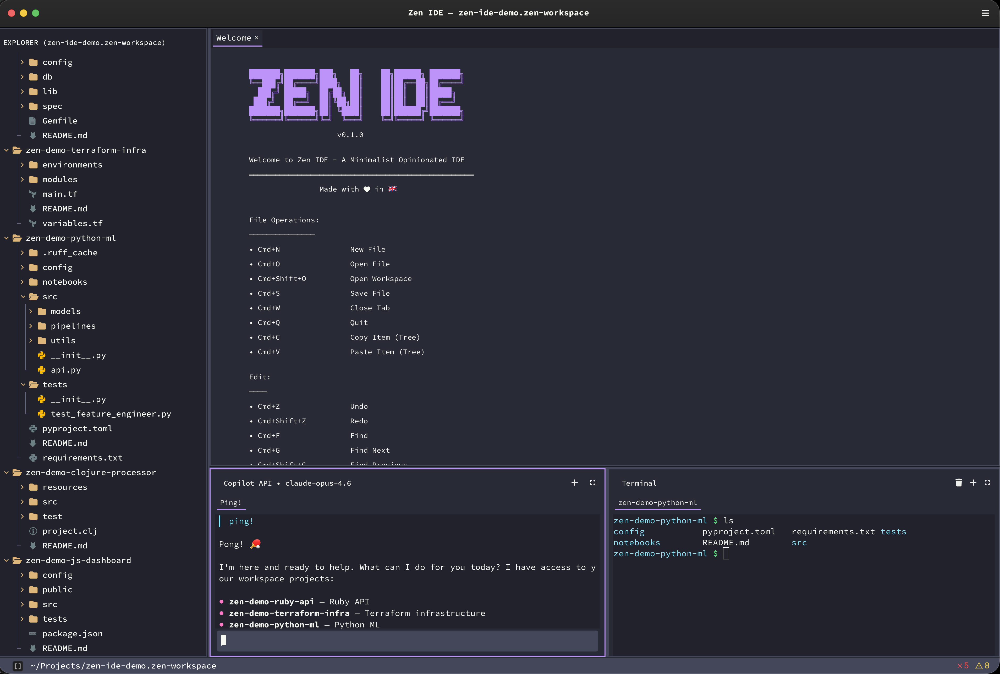
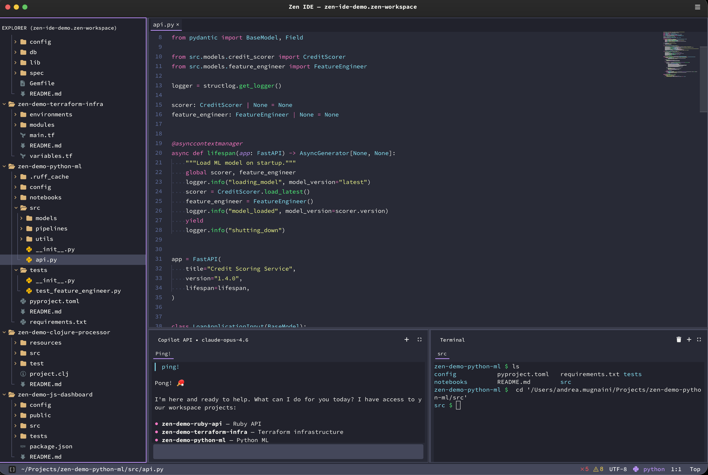
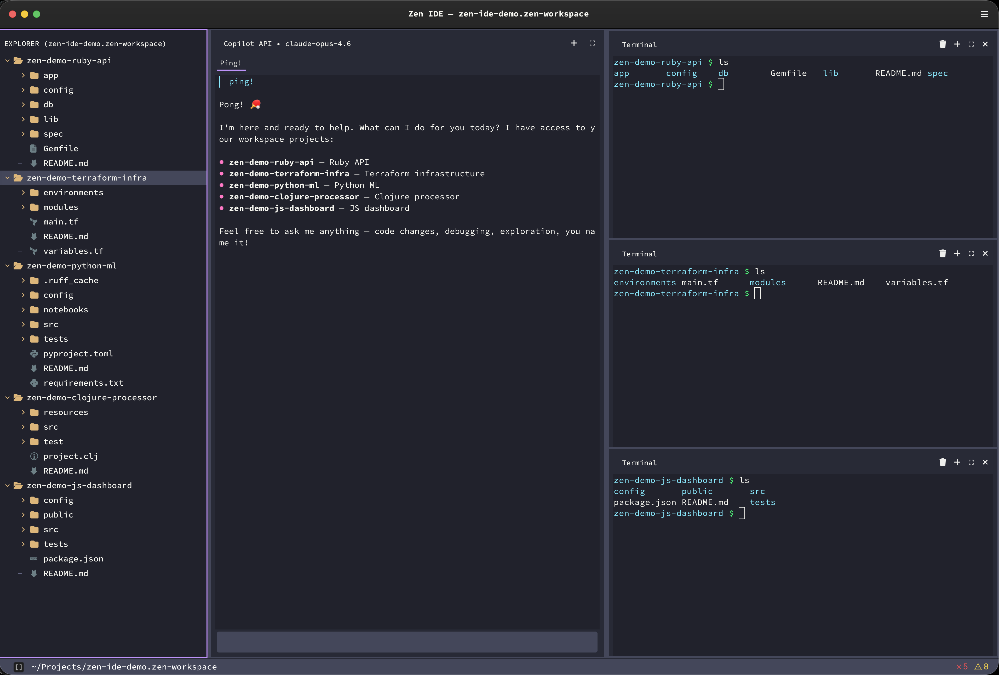

# Zen IDE

<div align="left">    
  
  [](https://github.com/4mux/zen-ide/actions/workflows/build.yml)
  
  A minimalist and opinionated IDE built with Python and [GTK4](https://gitlab.gnome.org/GNOME/gtk).
  
</div>

## Screenshots

<table>
  <tr>
    <td colspan="2"></td>
  </tr>
  <tr>
    <td></td>
    <td></td>
  </tr>
</table>

## Features

- ✏️ **Editor** — GtkSourceView 5 with syntax highlighting, semantic highlighting, minimap, autocomplete, find & replace, indent guides, color preview, code folding
- 📂 **File Explorer** — Custom GtkSnapshot-rendered tree with Nerd Font icons, git status badges, drag & drop, vim-style navigation, multi-root workspaces
- 🔍 **Search** — Quick Open (`Cmd+P`), Global Search (`Cmd+Shift+F`), Go to Definition (`Cmd+Click`)
- 👁️ **File Previews** — Markdown, HTML, OpenAPI/Swagger, images, hex viewer
- 🔀 **Git** — Gutter diff markers, side-by-side diff view, commit history navigation, inline revert
- 🤖 **AI Chat** — Integrated AI Terminal running `claude` or `copilot` CLI with multi-tab sessions, plus inline ghost text completions
- 💻 **Terminal** — VTE with 256-color support, file path linking, shell aliases, workspace folder picker
- 📝 **Dev Pad** (`Cmd+.`) — Activity tracking, notes, quick resume links
- 🎨 **Sketch Pad** (`Cmd+Shift+D`) — ASCII/Unicode diagram editor, opens `.zen_sketch` files in editor with box-drawing shapes, arrows, export to PNG
- 🎭 **38 Themes** — Zen Dark/Light, Dracula, Gruvbox, Tokyo Night, Catppuccin, and more
- ⌨️ **Vim-Style UI** — Neovim-style floating popups, j/k navigation, context menus
- 💾 **Session Restore** — Reopens last files, layout, and panel positions on startup

### Platforms

- **macOS** — ✅ Supported
- **Debian Linux** — ✅ Supported

## Quick Start

### Requirements

- Python 3.14+, [uv](https://docs.astral.sh/uv/getting-started/installation), macOS (Homebrew) or Linux (apt)

Then you can run

```bash
make install   # installs everything: GTK4 system deps, Python venv, dev tools, and the 'zen' CLI command
make run       # launch Zen IDE
```

After install you can also open Zen from any terminal:

```bash
zen .                                 # open current directory
zen file.py                           # open a file
zen ~/projects/my-app.zen-workspace   # open a workspace
```
## Supported Languages

Smart features (autocomplete, semantic highlighting) for Python, JavaScript/TypeScript, and Terraform.
Syntax highlighting via GtkSourceView built-in specs (100+ languages). .

> See [`docs/2026_02_20_supported_formats.md`](docs/2026_02_20_supported_formats.md) for the full reference including viewer modes, file detection, and feature levels.

## AI Setup

Zen IDE runs the `claude` or `copilot` CLI directly inside the integrated AI Terminal.

- **AI chat** — install/authenticate the Claude CLI and/or GitHub Copilot CLI; Zen auto-detects what is available
- **Inline completions** — ghost text suggestions are still powered by Copilot auth detected from your local machine

Open AI chat → click the provider dropdown → choose Claude or Copilot. See [`docs/wiki/AI-Setup.md`](docs/wiki/AI-Setup.md) for details.

## Makefile Commands

Run `make` to see all available targets. Key ones:

```bash
make install        # Install everything (system deps + venv + dev tools + CLI)
make run            # Run the IDE
make tests          # Run tests
make lint           # Run linter and formatter
make dist           # Build standalone app bundle (macOS)
make clean          # Remove build artifacts
```

## Keyboard Shortcuts

Press `Cmd+Shift+/` (macOS) or `Ctrl+Shift+/` (Linux) inside the IDE to see all shortcuts.

## Configuration

Settings are stored in `~/.zen_ide/settings.json` which auto-generates on the first start.

See `docs/2026_02_12_settings_reference.md` for details.

## License

[MIT License](LICENSE)

### Third-Party Notices

Zen IDE bundles **ZenIcons.ttf**, a subset font derived from [Nerd Fonts](https://www.nerdfonts.com/). 

See [THIRD_PARTY_LICENSES](THIRD_PARTY_LICENSES) for full details.
